# Creature Mart

>This is a shop for buying and collecting mystical creatures. However, it can be a template for creating your own store in telegram bot. You can try out the bot [here](https://t.me/Creature_Mart_bot)

---

## Starting

The `aiogram` library was used to create the bot. Therefore, you will need to install all the necessary dependencies to work:

```
pip install -r requirements.txt
```

After installing requirements you need fill `data/text/config.txt`:
```
123456789 \ telegram token
123,123 \ telegram id admins, separated by commas
https://discord.gg/BGVGCcnx,https://discord.gg/BGVGCcnx \ tutor-maintenance links
https://telegra.ph/Polzovatelskoe-soglashenie-05-30-6 \ user acceptation link
123,123 \ telegram tutors ids, separated by commas
https://discord.gg/BGVGCcnx \ support link
```

Now, you can start the bot by entering the following command in the console:

```commandline
python main.py
```

___

## Running

- Firstly, you need to solve a capcha
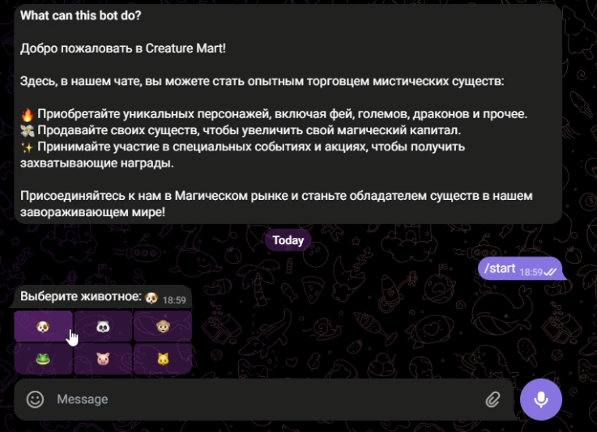

- And accept the user acceptation
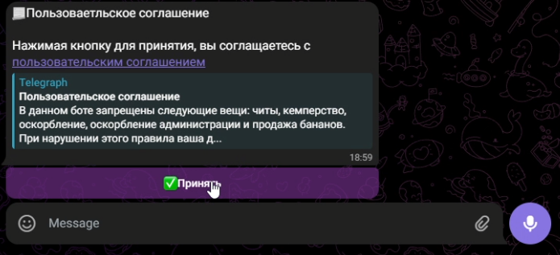

- After there actions you will see the main menu
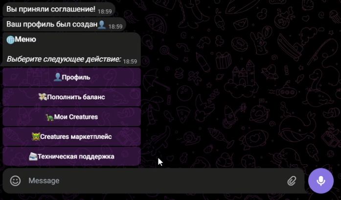

- If you click on 👤Профиль(profile), you will see your profile number, which is hidden and is telegram id
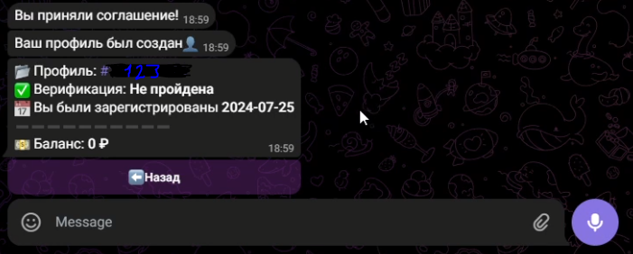

- If you click on 📨Техническая поддержка(support), you will see an instruction, how to request support, and a button with a link to the assistant
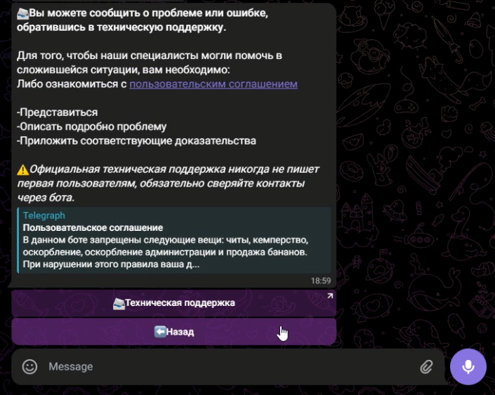

- If you click on 💸Пополнить баланс(top up your balance), you will see a message with minimum amount to deposit and with request to enter the required amount
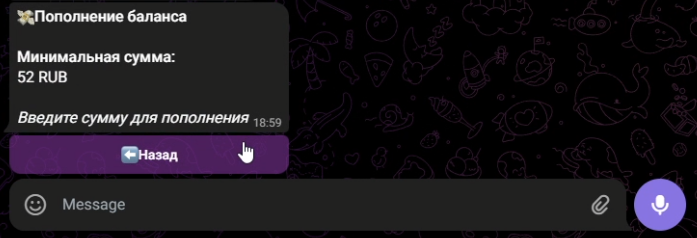

- After entering deposit amount, you will see a message with some choices to deposit   
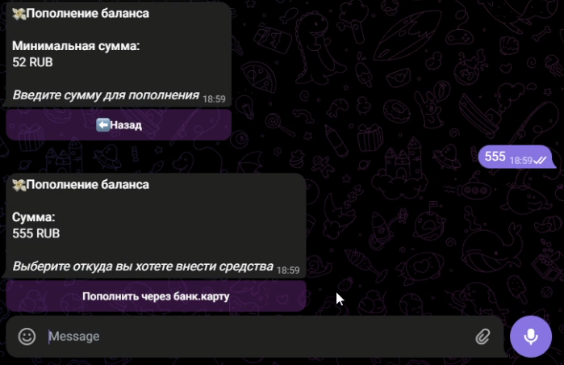

- After depositing you need to send a receipt to support using the link in the message
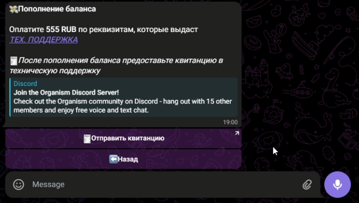

- If you click on 🐲Creatures маркетплейс(marketplace), you will see all collections of creatures, and you can choice a collection and creature. In the marketplace you have possibility to buy and sell your creatures
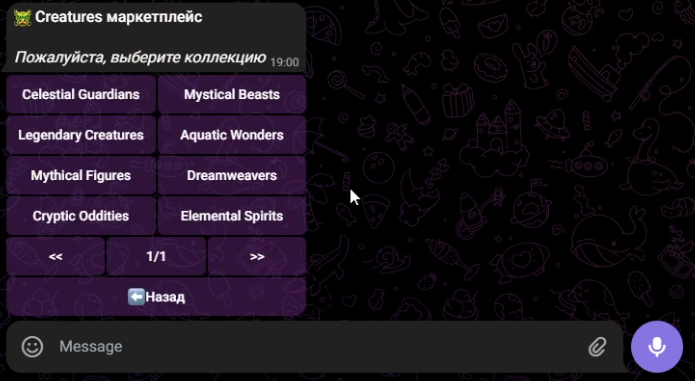
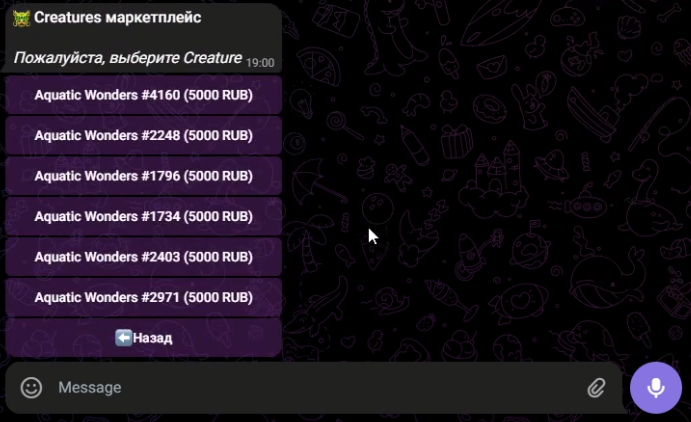
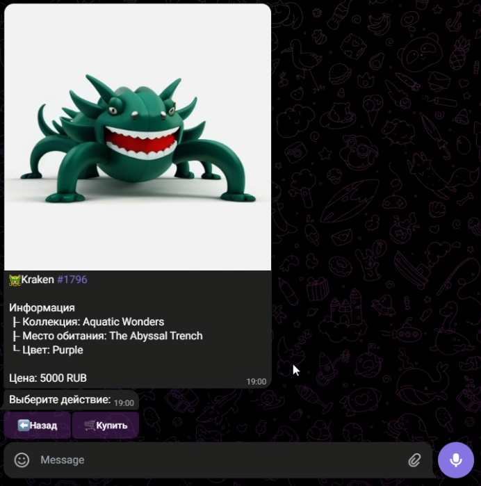

- After buying creature if you click on 🐢Мои Creatures(own collection), you will see all creatures you have
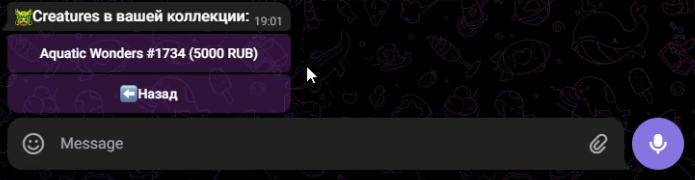

---

## Administration

- As for administration, if you send command `/admin`, you will see all information about admins possibilities
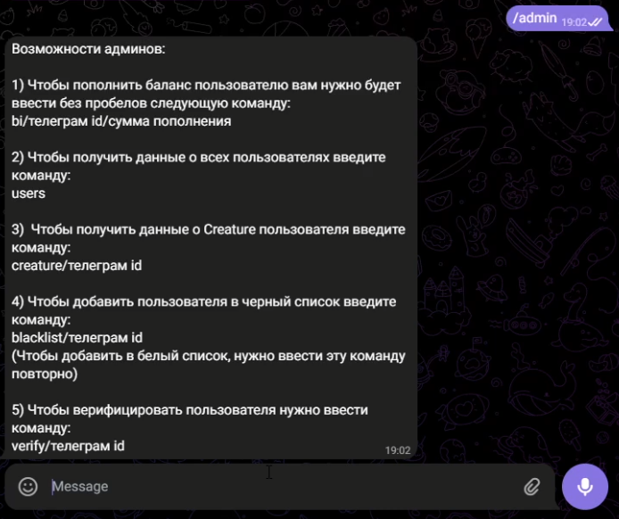

### Commands

1. `bi/id/amount` - will increase user balance, id - profile number (telegram id)
2. `users` - will show you all bot users
3.  `createre/id` - will show you all creatures of certain user
4. `blacklist/id` - will add user to blacklist
5. `verify/id` - will verify user profile
